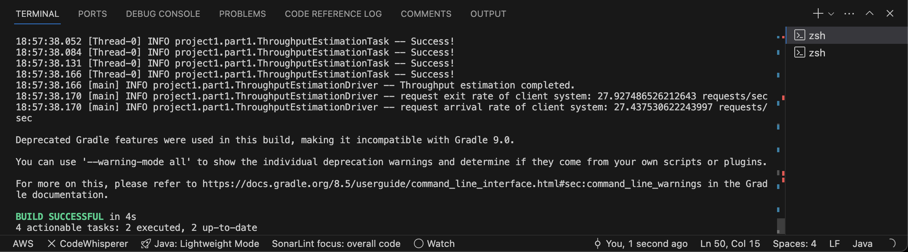
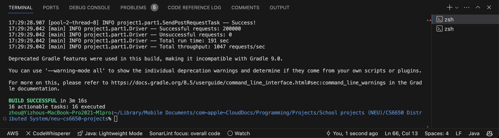
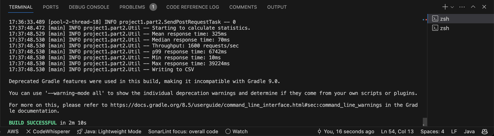
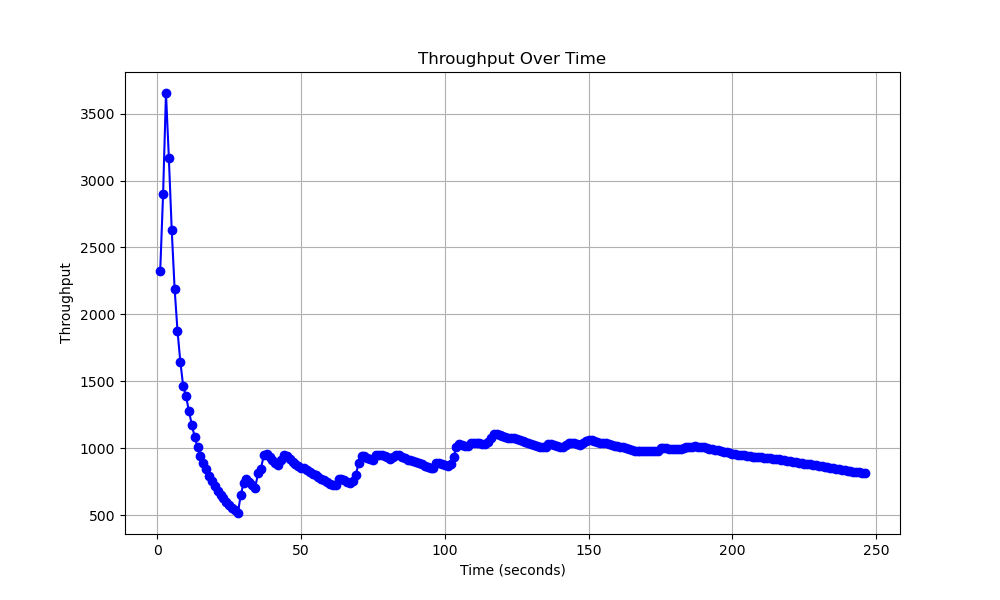

# git-repo-URL: https://github.com/lyz-sys/neu-cs6650-projects

# client description:
## part1
Part one's client side code is located in src/main/java/projct1/part1. Shared classes between part one and two's client are located in their parent folder. The Driver class is the entry point. It distributes tasks among threads, and starts the threads to visit the server on EC2. The configuration for first threads distribution is 32 threads in total, 1000 requests per thread. The configuration for sescond threads distribution is 1680 threads in total, 100 requests per thread. SendPostRequestTask handle the logic for individual thread's task. ThroughputEstimationDriver class is used for Little's law Prediction. The arrival rate of my system approximately equal to exit rate of my system, so the system is doing fine.

Little's law prediction driver output:

Main driver output window:

## part2
Part two's client side code is located in src/main/java/projct1/part2. It sends the task in its driver class. Each thread's task logic is encapuslated in its SendPostRequestTask class. This time, we the SendPostRequestTask is slightly different than the one in part1. Since we need to record each request into csv, and claculate additional statistics based on the record. We create RequestResult class for each record, and Util class to calculate statistics and print the results in terminal. Since this time we use Executor service in driver, the throughput is significantly increased.

Main driver output window:

## bonus points
Below I configured normal tomcat servlet in my server at port 8080, and I also deployed Springboot's servlet at port 8081. Clearly, in terms of arrival and exit rate, the Springboot's version is quicker by at 3 more request per second. normal servlet scrpts are in src/main/java/project1/webapp, and Springboot's are in src/main/java/project1/sbwebapp.

## plot
Throughput plots:

