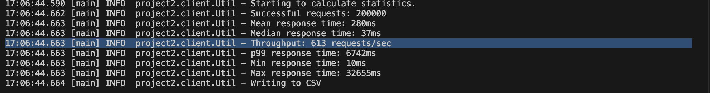
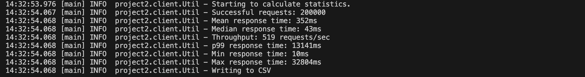
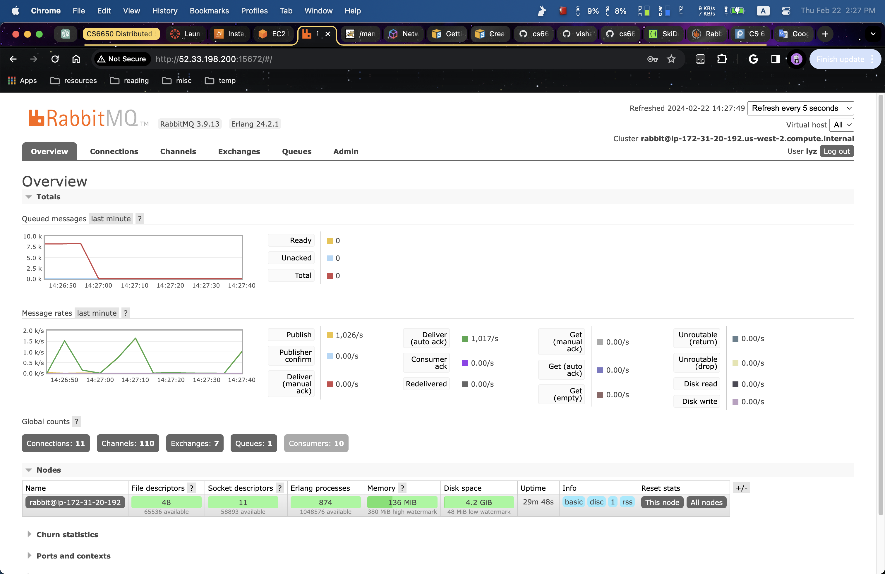

# git-repo-URL: https://github.com/lyz-sys/neu-cs6650-projects-v2

# Description 
The project 2's code is located at src/main/java/project2. There are four packages in total one for client, one for server, one for consumer, and one for additional tools. For the server side code, I have ChannelPool, RabitMQUtil and SkierServlet class. The ChannelPool is a data structure that leverages java blocking queue. It was used in RabitMQUtil to manage Channel usage so that only fixed amount of Channel is created and shared by threads. The RabitMQUtil handle rmq related logic including initialization, message sending etc. The SkierServlet is the original servlet program used in project 1. In this project, I include more url and json payload validation logic. Additionally, I send corresponding data to rmq by using RabitMQUtil. The consumer is implemented in serverbackendconsumer folder. It uses rmq and multithreading to get message from rmq queue and process the info to a map

# Metric Results and RMQ Console
metrics with load-balencer

metrics without load-balencer

rmq console profile

